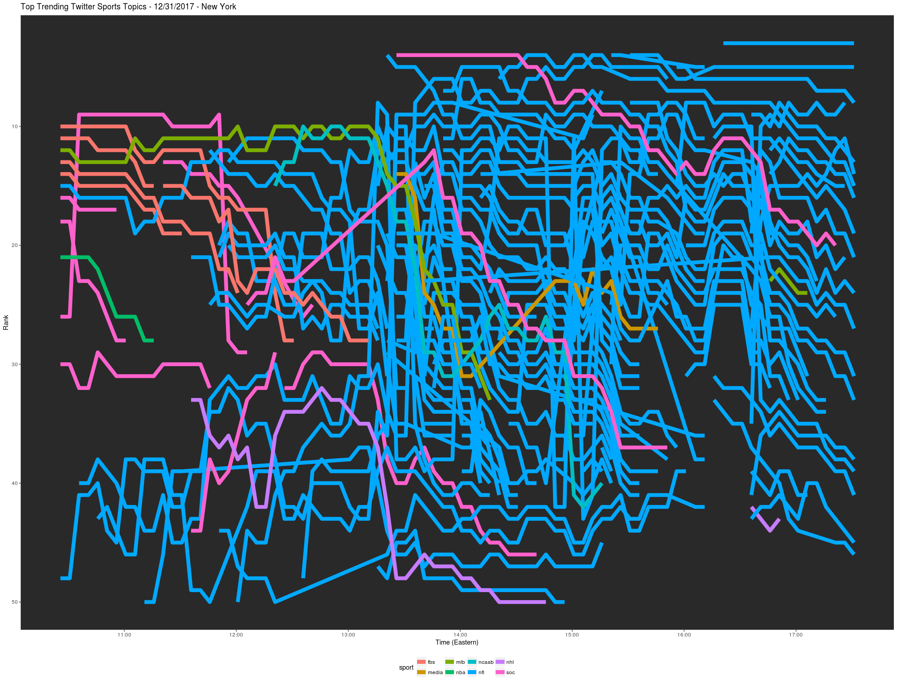

# Trending-Agent
This is just a script in R to extract what is trending at a location. I have the script set up to check what's trending in Chicago every five minutes over a specified number of times. The script can be easily altered to find what is trending in the location closest to a given set of coordinates.
For instance, below is a line graph of the top sports trends in the New York area on December 30, 2017. Each color relates to a different professional sport. Notice that there are very few NFL tweets before the kickoff of the day's first block of games, but a slew of NFL trends afterwards. They are replaced by a new set of NFL-related trends after kickoff of the second block of games.

