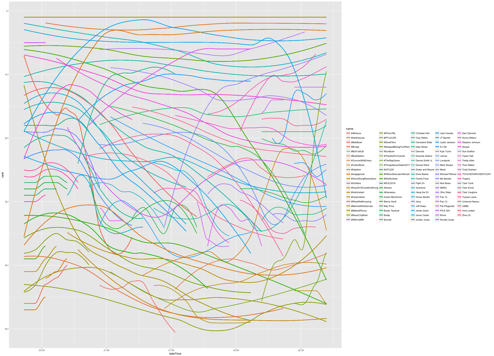

# Trending-Agent
This is just a script in R to extract what is trending at a location. I have the script set up to check what's trending in Chicago every five minutes over a specified number of times. The script can be easily altered to find what is trending in the location closest to a given set of coordinates.

